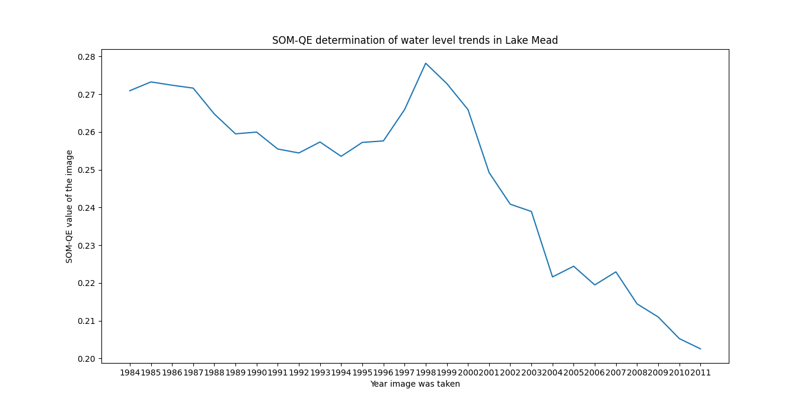

SOM-QE is a software tool that can be used to detect differences within data sets. For example, it can be applied to tell the differences between two sets of medical images taken from the same patient at different times - possibly two consecutive clinical visits. This can assist the radiologists/surgeons in determining the effects of their prescription on the patient between the duration of the two clinical visits.

It is based on the artificial neural network algorithm called Self-Organizing Map (SOM), developed by Teuvo Kohonen. You can read more about it in his book, [MATLAB Implementations and Applications of the Self-Organizing Map](http://docs.unigrafia.fi/publications/kohonen_teuvo/MATLAB_implementations_and_applications_of_the_self_organizing_map.pdf), or in one of his numerous publications available online.

After learning a data set, the final weights of SOM are found to have a difference with the real values of the data. This difference is known as the quantization error (QE), and is traditionally used to tell how close SOM was to the real values. In SOM-QE, the values are used to tell differences between the contents of data sets, an idea that finds numerous applications in life. You can read on how we used SOM-QE to tell the difference between two sets of medical images, obtained from a patient with a sprained knee from this open source paper, [Detection of small changes in medical and random-dot images comparing self-organizing map performance to human detection](https://www.sciencedirect.com/science/article/pii/S2352914817300059), for details.

In this demonstration of the working of SOM-QE, an implementation of SOM, named [MiniSOM](https://github.com/JustGlowing/minisom), is used.

SOM-QE is used to process satellite images of Lake Mead - a water reservoir formed by the Hoover Dam on the Colorado River in the Southwestern United States. The aim is to determine the yearly raising/falling of water levels in the lake, which is significant in determining effects of drought, climate change, etc. The duration covered is from the year 1984 to 2011. The SOM-QE values for each image were obtained, shown in this figure: 

These values indicate the changing water levels of the lake over the years, and corresponds with the findings of other measurements by organization like [Bureau of Reclamation](https://www.usbr.gov/lc/region/g4000/lakemead_line.pdf), as accessed on 3rd June 2023 or [NASA's earth observatory](https://earthobservatory.nasa.gov/images/45945/water-level-changes-in-lake-mead) which sums up the situation thus:
>'Lake levels rose steadily through the 1980s, reaching 24.8 million acre-feet in August 1985, when the bottom image was taken. But as of August 2010 (top image), Lake Mead held 10.35 million acre-feet, just 37 percent of the lake's capacity.' 

Check out the link for the images referred to in this quote. Note the corresponding SOM-QE values for year 1985 (higher) and for year 2010 (low).
